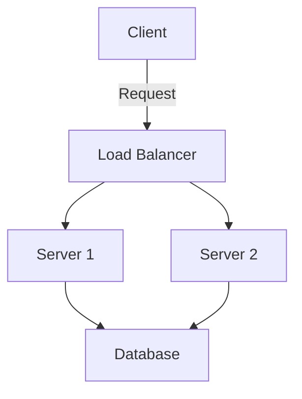

# Architecture Diagram Guide

A comprehensive guide to drawing clear, effective system design diagrams.

## Why Diagrams Matter

Good diagrams:
- **Communicate ideas quickly** - A picture is worth a thousand words
- **Reveal problems early** - Visualizing helps spot issues before coding
- **Facilitate discussion** - Team members can point at components
- **Document decisions** - Future reference for why systems work this way
- **Aid interviews** - Essential for system design interviews

---

## Diagramming Tools

### Free Online Tools

#### 1. Excalidraw (Recommended for Beginners)
**Link:** https://excalidraw.com/

**Best for:**
- Quick sketches and brainstorming
- Hand-drawn aesthetic
- Simple, distraction-free interface
- No account required

**Features:**
- ✅ Instant start - no signup
- ✅ Collaborative real-time editing
- ✅ Export to PNG/SVG
- ✅ Hand-drawn style looks natural
- ✅ Infinite canvas

**When to use:** Interviews, quick brainstorms, informal discussions

---

#### 2. draw.io / diagrams.net (Recommended for Detailed Diagrams)
**Link:** https://draw.io/

**Best for:**
- Professional documentation
- Detailed technical diagrams
- Complex architectures
- Presentations

**Features:**
- ✅ Extensive shape libraries (AWS, GCP, Azure icons)
- ✅ Professional appearance
- ✅ Integration with Google Drive, GitHub
- ✅ Export to multiple formats
- ✅ Free and open source

**When to use:** Documentation, architecture reviews, presentations

---

#### 3. LucidChart
**Link:** https://www.lucidchart.com/

**Best for:**
- Team collaboration
- Enterprise environments
- Template-based designs

**Features:**
- ✅ Real-time collaboration
- ✅ Extensive template library
- ✅ Integration with Confluence, Slack
- ✅ Clean, professional output
- ❌ Free tier limited (60 objects)

**When to use:** Team projects, professional documentation with templates

---

#### 4. Mermaid (Text-Based)
**Link:** https://mermaid.js.org/ or https://mermaid.live/

**Best for:**
- Version-controlled diagrams
- Markdown documentation
- GitHub README files
- Quick text-to-diagram

**Features:**
- ✅ Text-based (version control friendly)
- ✅ Renders in GitHub, GitLab
- ✅ Multiple diagram types
- ✅ Fast for those who prefer typing

**Example:**


**When to use:** Documentation in code repositories, automated diagram generation

---

### Offline Tools

#### 5. Paper & Pencil (Seriously!)
**Best for:**
- Interview practice
- Initial brainstorming
- Rapid iteration
- Learning

**Why it's great:**
- ✅ Zero learning curve
- ✅ Forces clarity (can't undo easily)
- ✅ Natural for interviews
- ✅ No technical issues

**When to use:** Interviews, first drafts, study sessions

---

#### 6. Whiteboard
**Best for:**
- Team discussions
- Design reviews
- Teaching/explaining
- Collaborative design

**When to use:** Office discussions, interview practice, brainstorming sessions

---

## Standard Symbols & Components

### Basic Building Blocks

```
┌─────────────────────────────────────────────────────────────┐
│                    COMMON DIAGRAM SYMBOLS                    │
└─────────────────────────────────────────────────────────────┘

┌──────────┐
│  Client  │  = User, Browser, Mobile App, External System
└──────────┘

┌──────────┐
│  Server  │  = Application Server, API Server, Web Server
└──────────┘

┌──────────┐
│ Database │  = SQL Database, NoSQL Database, Data Store
└──────────┘

┌──────────┐
│  Cache   │  = Redis, Memcached, In-Memory Cache
└──────────┘

┌──────────┐
│  Queue   │  = Message Queue, Kafka, RabbitMQ, SQS
└──────────┘

╔══════════╗
║   CDN    ║  = Content Delivery Network (double line for edge)
╚══════════╝

▼ ▼ ▼ ▼ ▼
Load Balancer = Distributes traffic (arrows or special box)

[Storage]     = Object Storage, S3, Blob Storage

( Worker )    = Background Worker, Async Processor
```

### Arrows & Data Flow

```
─────>        = Request/Data Flow (one way)

<────>        = Bidirectional Communication

═════>        = High-volume data flow (thick arrow)

- - - >       = Async/Background Communication

─────> (1)    = Numbered steps in sequence
─────> (2)

─────> (read) = Labeled operations
─────> (write)
```

### Grouping & Boundaries

```
┌─────────────────────────────────────┐
│         Region / Data Center        │
│  ┌─────────┐      ┌─────────┐     │
│  │ Server1 │      │ Server2 │     │
│  └─────────┘      └─────────┘     │
└─────────────────────────────────────┘

┏━━━━━━━━━━━━━━━━━━━━━━━━━━━━━━━━━━━┓
┃         Availability Zone 1        ┃
┃                                     ┃
┗━━━━━━━━━━━━━━━━━━━━━━━━━━━━━━━━━━━┛

╔═════════════════════════════════════╗
║           Cloud Provider            ║  (AWS, GCP, Azure)
╚═════════════════════════════════════╝
```

---

## Diagram Types

### 1. High-Level Architecture Diagram

**Purpose:** Show main components and their relationships

**What to include:**
- Major components (clients, servers, databases)
- Data flow between components
- External services
- Key infrastructure (load balancers, caches)

**Example: URL Shortener**
```
┌──────────┐
│  Users   │
└────┬─────┘
     │
     │ HTTPS
     ▼
┌────────────────┐
│ Load Balancer  │
└────┬───────────┘
     │
     │ Distribute requests
     ▼
┌────────────────────────┐
│   API Servers (×5)     │
│  - Shorten URL         │
│  - Redirect            │
└───┬────────────────────┘
    │
    ├──────────┬──────────┐
    │          │          │
    ▼          ▼          ▼
┌────────┐ ┌──────────┐ ┌────────┐
│ Redis  │ │ Database │ │ Object │
│ Cache  │ │  (SQL)   │ │Storage │
└────────┘ └──────────┘ └────────┘
```

**Key Principles:**
- ✅ Keep it simple - show only essential components
- ✅ Top-to-bottom or left-to-right flow
- ✅ Label connections (HTTP, TCP, etc.)
- ✅ Show cardinality (1 load balancer, 5 servers)

---

### 2. Data Flow Diagram

**Purpose:** Show how data moves through the system

**What to include:**
- Numbered sequence of operations
- Data transformations
- Storage points
- Processing steps

**Example: User Upload Photo**
```
(1) User
    │
    │ Upload photo
    ▼
(2) API Server
    │
    │ Validate & resize
    ▼
(3) Object Storage (S3)
    │
    │ Store original
    ▼
(4) Queue (Kafka)
    │
    │ Async processing
    ▼
(5) Worker
    │
    │ Generate thumbnails
    ▼
(6) CDN
    │
    │ Cache & distribute
    ▼
(7) Users worldwide
```

**Key Principles:**
- ✅ Number each step
- ✅ Show data transformations
- ✅ Indicate sync vs async operations
- ✅ Label data being transferred

---

### 3. Component Interaction Diagram

**Purpose:** Show detailed interactions between specific components

**What to include:**
- Request/response patterns
- Error handling paths
- Retry logic
- Timeout handling

**Example: Read with Cache**
```
Client               API Server           Cache            Database
  │                      │                  │                  │
  │   GET /user/123      │                  │                  │
  ├─────────────────────>│                  │                  │
  │                      │                  │                  │
  │                      │  Check cache     │                  │
  │                      ├─────────────────>│                  │
  │                      │                  │                  │
  │                      │  Cache MISS      │                  │
  │                      │<─────────────────┤                  │
  │                      │                  │                  │
  │                      │  Query user                         │
  │                      ├────────────────────────────────────>│
  │                      │                  │                  │
  │                      │  User data       │                  │
  │                      │<────────────────────────────────────┤
  │                      │                  │                  │
  │                      │  Store in cache  │                  │
  │                      ├─────────────────>│                  │
  │                      │                  │                  │
  │   User data          │                  │                  │
  │<─────────────────────┤                  │                  │
  │                      │                  │                  │
```

**Key Principles:**
- ✅ Show timing/sequence
- ✅ Include success and error paths
- ✅ Show all participants
- ✅ Label operations clearly

---

### 4. Deployment Diagram

**Purpose:** Show physical/logical deployment of components

**What to include:**
- Regions/availability zones
- Redundancy
- Network boundaries
- Load distribution

**Example: Multi-Region Deployment**
```
╔════════════════════════════════════════════════════════════╗
║                     Global Load Balancer                    ║
╚═══════════════════════╦═══════════════════╦════════════════╝
                        ║                   ║
        ┌───────────────╨──────┐   ┌────────╨────────────┐
        │   US-EAST Region     │   │   EU-WEST Region    │
        │  ┌────────────────┐  │   │  ┌────────────────┐ │
        │  │  Availability  │  │   │  │  Availability  │ │
        │  │    Zone 1      │  │   │  │    Zone 1      │ │
        │  │  ┌──────────┐  │  │   │  │  ┌──────────┐  │ │
        │  │  │ Server 1 │  │  │   │  │  │ Server 3 │  │ │
        │  │  └──────────┘  │  │   │  │  └──────────┘  │ │
        │  └────────────────┘  │   │  └────────────────┘ │
        │  ┌────────────────┐  │   │  ┌────────────────┐ │
        │  │  Availability  │  │   │  │  Availability  │ │
        │  │    Zone 2      │  │   │  │    Zone 2      │ │
        │  │  ┌──────────┐  │  │   │  │  ┌──────────┐  │ │
        │  │  │ Server 2 │  │  │   │  │  │ Server 4 │  │ │
        │  │  └──────────┘  │  │   │  │  └──────────┘  │ │
        │  └────────────────┘  │   │  └────────────────┘ │
        │                      │   │                      │
        │  ┌────────────────┐  │   │  ┌────────────────┐ │
        │  │  Database      │  │   │  │  Database      │ │
        │  │  (Primary)     │◄─┼───┼─▶│  (Replica)     │ │
        │  └────────────────┘  │   │  └────────────────┘ │
        └──────────────────────┘   └─────────────────────┘
```

**Key Principles:**
- ✅ Show redundancy
- ✅ Indicate replication
- ✅ Group by region/zone
- ✅ Show failover paths

---

## Best Practices

### 1. Start Simple, Add Detail

**❌ Don't start here:**
```
[Complex diagram with 20+ components, multiple layers,
 intricate connections, various protocols, etc.]
```

**✅ Start here:**
```
Client → Server → Database
```

**Then evolve:**
```
Client → Load Balancer → Servers (×3) → Database
```

**Then add:**
```
         ┌─ Cache
Client → Load Balancer → Servers → ┤
                                    └─ Database
```

### 2. Use Consistent Styles

**Within a diagram:**
- ✅ Same shape = same type (all databases are cylinders)
- ✅ Same arrow style = same communication type
- ✅ Same grouping style throughout

**Across diagrams:**
- ✅ Reuse symbols for same components
- ✅ Maintain color scheme (if using color)
- ✅ Keep layout patterns consistent

### 3. Label Everything

**❌ Bad:**
```
Box1 → Box2 → Box3
```

**✅ Good:**
```
Web Client ──HTTP──> API Server ──SQL──> PostgreSQL Database
```

**Even better:**
```
Web Client ──HTTPS (GET /users)──> API Server ──Query (SELECT)──> PostgreSQL
```

### 4. Show Cardinality

Indicate how many instances:

```
┌────────────┐
│  Client    │  (millions)
└──────┬─────┘
       │
       ▼
┌────────────┐
│LB (×2)     │  (2 instances for redundancy)
└──────┬─────┘
       │
       ▼
┌────────────┐
│Servers (×10)│  (10 instances)
└──────┬─────┘
       │
       ▼
┌────────────┐
│Database    │  (1 primary)
└────────────┘
```

### 5. Indicate Data Volume

```
Client ──10 req/sec──> Server ──1000 req/sec──> Database

User ──100MB photo──> API ──thumbnails (1MB)──> CDN
```

### 6. Use Layers

**Presentation Layer**
```
┌─────────────────────────────────────┐
│  Web App │ Mobile App │ API Clients │
└─────────────────────────────────────┘
```

**Application Layer**
```
┌─────────────────────────────────────┐
│  API Gateway │ Auth │ Business Logic│
└─────────────────────────────────────┘
```

**Data Layer**
```
┌─────────────────────────────────────┐
│  Cache │ Database │ Object Storage  │
└─────────────────────────────────────┘
```

### 7. Show Failure Scenarios

Use dashed lines or color to show:
- ❌ Failed connections
- ⚠️ Degraded paths
- 🔄 Fallback routes

```
                Primary Path
Client ────────────────────────> Server1 (❌ DOWN)
    │
    └─────Fallback─────────────> Server2 (✅ UP)
```

---

## Common Mistakes to Avoid

### ❌ Mistake 1: Too Much Detail
```
[Showing every single function call, every variable,
 every class, every API endpoint in one diagram]
```
**Fix:** Create multiple diagrams at different abstraction levels

### ❌ Mistake 2: No Context
```
Box → Box → Box
(What do these boxes do? What data flows? Why?)
```
**Fix:** Add labels, legends, and descriptions

### ❌ Mistake 3: Arrows Everywhere
```
[Everything connects to everything with crossing arrows]
```
**Fix:** Use layering, group related components, minimize crossings

### ❌ Mistake 4: Inconsistent Notation
```
[Database shown as rectangle, then circle, then cylinder
 in the same diagram]
```
**Fix:** Choose symbols and stick with them

### ❌ Mistake 5: Missing Scale Information
```
"Server" (Is it 1 server or 1000? Does it matter?)
```
**Fix:** Always indicate: 1 instance, ×10 instances, auto-scaled, etc.

---

## Diagram Templates

### Template 1: Basic Web Application
```
┌──────────┐
│  Users   │
└────┬─────┘
     │
┌────▼─────────────┐
│  Load Balancer   │
└────┬─────────────┘
     │
┌────▼──────────────────┐
│  App Servers (×N)     │
└────┬──────────────────┘
     │
     ├────────────┬────────────┐
     ▼            ▼            ▼
┌─────────┐  ┌─────────┐  ┌─────────┐
│  Cache  │  │Database │  │ Storage │
└─────────┘  └─────────┘  └─────────┘
```

### Template 2: Microservices Architecture
```
┌──────────┐
│  Clients │
└────┬─────┘
     │
┌────▼──────────┐
│ API Gateway   │
└────┬──────────┘
     │
     ├────────┬────────┬────────┐
     ▼        ▼        ▼        ▼
┌────────┐ ┌────────┐ ┌────────┐ ┌────────┐
│Service1│ │Service2│ │Service3│ │Service4│
└───┬────┘ └───┬────┘ └───┬────┘ └───┬────┘
    │          │          │          │
┌───▼──────────▼──────────▼──────────▼───┐
│         Message Queue (Kafka)           │
└─────────────────────────────────────────┘
    │          │          │          │
    ▼          ▼          ▼          ▼
┌────────┐ ┌────────┐ ┌────────┐ ┌────────┐
│  DB 1  │ │  DB 2  │ │  DB 3  │ │  DB 4  │
└────────┘ └────────┘ └────────┘ └────────┘
```

### Template 3: Data Pipeline
```
┌────────────┐     ┌──────────┐     ┌────────────┐
│Data Sources│────>│ Ingestion│────>│   Queue    │
└────────────┘     └──────────┘     └──────┬─────┘
                                            │
                                            ▼
                   ┌────────────────────────────┐
                   │  Stream Processing         │
                   │  (Transform, Enrich)       │
                   └──────┬─────────────────────┘
                          │
              ┌───────────┼───────────┐
              ▼           ▼           ▼
       ┌──────────┐ ┌──────────┐ ┌──────────┐
       │Analytics │ │Data Lake │ │ Real-time│
       │   DB     │ │ (S3)     │ │Dashboard │
       └──────────┘ └──────────┘ └──────────┘
```

---

## Interview Tips

### During System Design Interviews

1. **Start with boxes and arrows** - don't worry about prettiness
2. **Explain while you draw** - talk through your thought process
3. **Draw incrementally** - add complexity as discussion evolves
4. **Use the whiteboard space wisely** - leave room for additions
5. **Label clearly** - interviewer should understand without explanation
6. **Draw data flow** - show how requests move through system
7. **Iterate** - be ready to modify based on feedback

### Time Management
- 5-10 minutes: High-level diagram
- 10-15 minutes: Add detail to critical components
- 5-10 minutes: Show data flows and edge cases

---

## Quick Reference: Symbol Legend

Copy this legend into your diagrams for clarity:

```
┌────────────────────────────────────────────┐
│              SYMBOL LEGEND                 │
├────────────────────────────────────────────┤
│ ┌──────┐ = Client/User                    │
│ ┌──────┐ = Server/Application             │
│ ┌──────┐ = Database                       │
│ ┌──────┐ = Cache                          │
│ ▼▼▼▼▼  = Load Balancer                    │
│ [    ] = Storage/Queue                     │
│ ───>   = Sync request                      │
│ - - >  = Async message                     │
│ ═══>   = High volume                       │
└────────────────────────────────────────────┘
```

---

## Practice Exercise

**Try drawing these systems:**

1. **Simple:** Blog platform (users, posts, comments)
2. **Medium:** E-commerce checkout flow
3. **Complex:** Multi-region social media feed

Use the templates above as starting points!

---

## Next Steps

- Use [Problem Analysis Template](./problem-analysis-template.md) to define requirements first
- Apply [Component Selection Matrix](./component-selection-matrix.md) to choose technologies
- Use [Trade-off Analysis Framework](./trade-off-analysis-framework.md) to evaluate design decisions
- Practice with [Case Studies](../case-studies/) and [Design Templates](./url-shortener.md)
