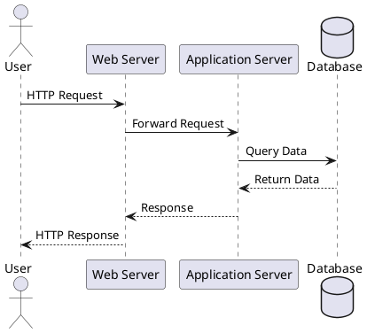

# System Design Tools Guide

A comprehensive guide to tools for diagramming, calculating, practicing, and implementing system designs.

## Table of Contents
- [Diagramming Tools](#diagramming-tools)
- [Calculation & Estimation Tools](#calculation--estimation-tools)
- [Practice Platforms](#practice-platforms)
- [Database Tools](#database-tools)
- [Monitoring & Observability](#monitoring--observability)
- [Cloud Platforms](#cloud-platforms)
- [Load Testing Tools](#load-testing-tools)
- [Development Tools](#development-tools)

---

## Diagramming Tools

### 1. Excalidraw

**Type:** Online Diagramming Tool  
**Cost:** Free  
**URL:** https://excalidraw.com/

**Best For:**
- Quick sketches and brainstorming
- Hand-drawn aesthetic
- Real-time collaboration
- Interview practice

**Features:**
- No account required
- Export to PNG, SVG, JSON
- Shareable links
- Extensive shape library
- End-to-end encrypted collaboration

**Pros:**
- Extremely easy to use
- Fast and responsive
- Great for interviews (mimics whiteboard)
- Open source

**Cons:**
- Less professional look
- Limited templates
- Basic styling options

**Best Use Case:** Quickly sketching system designs during interviews or brainstorming sessions.

---

### 2. draw.io (diagrams.net)

**Type:** Online/Desktop Diagramming Tool  
**Cost:** Free  
**URL:** https://app.diagrams.net/

**Best For:**
- Professional diagrams
- Complex system architectures
- Documentation
- Presentations

**Features:**
- Works offline (desktop app)
- Save to Google Drive, GitHub, OneDrive
- Extensive shape libraries (AWS, GCP, Azure icons)
- Export to PNG, SVG, PDF, HTML
- Version control integration

**Pros:**
- Completely free
- Professional output
- Large icon libraries
- Cross-platform
- Open source

**Cons:**
- Steeper learning curve
- Can be overwhelming with options
- Interface less intuitive than competitors

**Best Use Case:** Creating detailed, professional architecture diagrams for documentation.

---

### 3. LucidChart

**Type:** Online Diagramming Tool  
**Cost:** Free tier (60 objects), Paid plans from $7.95/month  
**URL:** https://www.lucidchart.com/

**Best For:**
- Team collaboration
- Professional presentations
- Interactive diagrams
- Real-time editing

**Features:**
- Real-time collaboration
- Integrations (Confluence, Slack, Google Workspace)
- Templates for system design
- Smart containers and linking
- Version history

**Pros:**
- Intuitive interface
- Excellent collaboration features
- Professional templates
- Good for presentations

**Cons:**
- Free tier very limited
- Requires subscription for serious use
- Can be slow with large diagrams

**Best Use Case:** Team-based architecture design and documentation with real-time collaboration.

---

### 4. Miro

**Type:** Online Whiteboard  
**Cost:** Free tier, Paid from $8/month  
**URL:** https://miro.com/

**Best For:**
- Collaborative brainstorming
- Workshops and meetings
- Mind mapping
- Design sprints

**Features:**
- Infinite canvas
- Real-time collaboration
- Templates and frameworks
- Integration with Jira, Slack, etc.
- Video chat integration

**Pros:**
- Great for collaboration
- Flexible and creative
- Easy to use
- Good for workshops

**Cons:**
- Not specialized for technical diagrams
- Free tier limited to 3 boards
- Can become messy with many elements

**Best Use Case:** Collaborative design sessions and brainstorming with distributed teams.

---

### 5. PlantUML

**Type:** Code-based Diagramming  
**Cost:** Free  
**URL:** https://plantuml.com/

**Best For:**
- Version-controlled diagrams
- Documentation as code
- Automated diagram generation
- Consistent styling

**Features:**
- Text-based diagram definition
- Integration with IDE, Markdown, docs
- Multiple output formats
- Sequence, class, component diagrams

**Example:**


**Pros:**
- Version control friendly
- Consistent styling
- Easy to maintain
- Great for documentation

**Cons:**
- Learning curve for syntax
- Less visual feedback while creating
- Limited customization

**Best Use Case:** Technical documentation where diagrams need to be version-controlled with code.

---

### 6. Figma

**Type:** Design Tool (with diagramming capabilities)  
**Cost:** Free tier, Paid from $12/month  
**URL:** https://www.figma.com/

**Best For:**
- Beautiful, pixel-perfect diagrams
- Presentations
- Design-heavy documentation
- UI/UX integration

**Features:**
- Real-time collaboration
- Component libraries
- Auto-layout
- Export to various formats
- Plugins ecosystem

**Pros:**
- Beautiful output
- Professional design tools
- Excellent collaboration
- Large community

**Cons:**
- Overkill for simple diagrams
- Learning curve
- Focused on design, not diagrams

**Best Use Case:** Creating polished, presentation-quality architecture diagrams.

---

### 7. Whimsical

**Type:** Online Diagramming & Wireframing  
**Cost:** Free tier (4 boards), Paid from $10/month  
**URL:** https://whimsical.com/

**Best For:**
- Quick, clean diagrams
- Flowcharts
- Wireframes
- Mind maps

**Features:**
- Fast and intuitive
- Clean, modern aesthetic
- Real-time collaboration
- Templates

**Pros:**
- Very fast to use
- Beautiful output
- Intuitive interface
- Good for quick sketches

**Cons:**
- Free tier very limited
- Fewer features than competitors
- Less suitable for complex diagrams

**Best Use Case:** Rapid prototyping and clean, simple diagrams.

---

### 8. ASCII Diagram Tools

**Tools:**
- **ASCIIFlow:** https://asciiflow.com/
- **Monodraw (Mac):** https://monodraw.helftone.com/

**Best For:**
- Text-based documentation
- README files
- Terminal-based presentations
- Minimalist diagrams

**Example:**
```
┌─────────────┐     ┌─────────────┐     ┌─────────────┐
│   Client    │────▶│Load Balancer│────▶│   Server 1  │
└─────────────┘     └─────────────┘  │  └─────────────┘
                                     │
                                     │  ┌─────────────┐
                                     └─▶│   Server 2  │
                                        └─────────────┘
```

**Pros:**
- Works anywhere (terminal, docs, code)
- Version control friendly
- No special tools needed
- Fast to create

**Cons:**
- Limited aesthetics
- Time-consuming for complex diagrams
- Less intuitive

**Best Use Case:** Documentation in README files and code comments.

---

## Calculation & Estimation Tools

### 1. Online Calculators

#### Capacity Calculator (Custom)
Build your own or use spreadsheets for:
- Storage estimates
- Bandwidth calculations
- QPS projections
- Cost estimates

**Example Google Sheets Structure:**
```
Daily Active Users:     10,000,000
Requests per user/day:  50
QPS = DAU × requests ÷ 86400 = 5,787
Peak QPS (3x) = 17,361
```

#### AWS Calculator
- **URL:** https://calculator.aws/
- **Purpose:** Estimate AWS costs for infrastructure
- **Use For:** Cloud cost estimation during design

#### GCP Pricing Calculator
- **URL:** https://cloud.google.com/products/calculator
- **Purpose:** Estimate Google Cloud costs

---

### 2. Python REPL / Jupyter Notebooks

**For Quick Calculations:**
```python
# Storage estimation
daily_active_users = 100_000_000
tweets_per_user = 2
tweet_size_bytes = 500

daily_storage = daily_active_users * tweets_per_user * tweet_size_bytes
daily_storage_gb = daily_storage / (1024 ** 3)
yearly_storage_tb = daily_storage_gb * 365 / 1024

print(f"Daily storage: {daily_storage_gb:.2f} GB")
print(f"Yearly storage: {yearly_storage_tb:.2f} TB")
```

**Setup:**
```bash
# Install Jupyter
pip install jupyter

# Start notebook
jupyter notebook
```

---

### 3. Spreadsheet Templates

**Google Sheets / Excel Templates for:**

**Capacity Planning:**
- User growth projections
- Storage requirements
- Bandwidth calculations
- Server capacity needs

**Cost Estimation:**
- Infrastructure costs
- Storage costs
- Bandwidth costs
- Total cost of ownership

**Example Template Sections:**
1. Input Parameters (users, growth rate, usage patterns)
2. Calculations (QPS, storage, bandwidth)
3. Infrastructure Requirements (servers, databases, cache)
4. Cost Breakdown
5. Graphs and Visualizations

---

### 4. Back-of-Envelope Calculation Reference

**Key Numbers to Memorize:**
```
1 million ≈ 10^6
1 billion ≈ 10^9
1 day ≈ 100,000 seconds (actually 86,400)
1 month ≈ 2.5 million seconds
1 year ≈ 30 million seconds

1 KB = 1,000 bytes
1 MB = 1,000 KB
1 GB = 1,000 MB
1 TB = 1,000 GB
```

**Quick Reference Card:** Create a physical or digital card with these numbers for interview prep.

---

## Practice Platforms

### 1. System Design Interview Platforms

#### Pramp
- **URL:** https://www.pramp.com/
- **Cost:** Free
- **Features:**
  - Peer-to-peer mock interviews
  - System design questions
  - Scheduled practice sessions
  - Instant feedback

**Best For:** Practicing with real people in interview-like settings.

---

#### Interviewing.io
- **URL:** https://interviewing.io/
- **Cost:** Free for practice, paid for real interviews
- **Features:**
  - Anonymous practice interviews
  - Experienced interviewers
  - System design track
  - Recording and playback

**Best For:** Getting feedback from experienced engineers.

---

#### Exponent
- **URL:** https://www.tryexponent.com/
- **Cost:** Paid ($39/month)
- **Features:**
  - Video courses
  - Practice problems
  - Mock interviews
  - Community

**Best For:** Structured learning and practice.

---

### 2. Coding & Implementation Practice

#### LeetCode
- **URL:** https://leetcode.com/
- **Features:**
  - System design section (limited)
  - Discussion forums
  - Company-specific questions

**Best For:** Algorithm practice, some system design context.

---

#### HackerRank
- **URL:** https://www.hackerrank.com/
- **Features:**
  - Coding challenges
  - System design basics
  - Certification programs

---

### 3. Hands-On Lab Platforms

#### Katacoda (Now part of O'Reilly)
- Interactive learning scenarios
- Kubernetes, Docker, distributed systems

#### A Cloud Guru / Linux Academy
- Hands-on labs for cloud platforms
- System design implementations

---

## Database Tools

### 1. PostgreSQL

**Type:** Relational Database  
**Cost:** Free (Open Source)  
**Use For:** Learning SQL, ACID transactions, relational modeling

**Getting Started:**
```bash
# Install via Docker
docker run --name postgres -e POSTGRES_PASSWORD=mysecretpassword -d postgres

# Connect
docker exec -it postgres psql -U postgres
```

**Why Learn:**
- Industry-standard SQL database
- Strong consistency
- ACID transactions
- Rich feature set

---

### 2. Redis

**Type:** In-Memory Data Store  
**Cost:** Free (Open Source)  
**Use For:** Caching, sessions, real-time applications

**Getting Started:**
```bash
# Install via Docker
docker run --name redis -d redis

# Connect
docker exec -it redis redis-cli
```

**Why Learn:**
- Most popular cache
- Fast (in-memory)
- Versatile data structures
- Pub/sub messaging

**Practice Exercises:**
- Implement cache-aside pattern
- Build a rate limiter
- Create a leaderboard

---

### 3. MongoDB

**Type:** NoSQL Document Database  
**Cost:** Free (Open Source)  
**Use For:** Document storage, flexible schemas

**Getting Started:**
```bash
# Install via Docker
docker run --name mongodb -d mongo

# Connect
docker exec -it mongodb mongosh
```

**Why Learn:**
- Popular NoSQL database
- Flexible schema
- Good for hierarchical data
- Easy to get started

---

### 4. Cassandra

**Type:** Wide-Column Store  
**Cost:** Free (Open Source)  
**Use For:** High write throughput, time-series data

**Why Learn:**
- Distributed by design
- High availability
- Linear scalability
- Eventual consistency

**Considerations:**
- More complex setup
- Best learned after understanding basics

---

### 5. Database GUIs

**DBeaver**
- Free, universal database tool
- Supports PostgreSQL, MySQL, MongoDB, etc.
- Good for learning and exploring

**TablePlus**
- Modern database GUI (Mac, Windows)
- Clean interface
- Free tier available

**pgAdmin**
- PostgreSQL-specific
- Free and powerful
- Good for advanced PostgreSQL features

---

## Monitoring & Observability

### 1. Prometheus

**Type:** Time-Series Database & Monitoring  
**Cost:** Free (Open Source)  
**Use For:** Metrics collection and alerting

**Getting Started:**
```bash
# Install via Docker
docker run -p 9090:9090 prom/prometheus
```

**Why Learn:**
- Industry standard for metrics
- Pull-based model
- Powerful query language (PromQL)
- Great for Kubernetes

---

### 2. Grafana

**Type:** Visualization & Dashboards  
**Cost:** Free (Open Source)  
**Use For:** Creating monitoring dashboards

**Getting Started:**
```bash
# Install via Docker
docker run -p 3000:3000 grafana/grafana
```

**Why Learn:**
- Beautiful dashboards
- Integrates with Prometheus, many data sources
- Alerting capabilities

**Practice:**
- Set up Prometheus + Grafana
- Create custom dashboards
- Set up alerts

---

### 3. Jaeger / Zipkin

**Type:** Distributed Tracing  
**Cost:** Free (Open Source)  
**Use For:** Tracing requests across microservices

**Why Learn:**
- Essential for microservices
- Understand request flow
- Performance debugging

---

### 4. ELK Stack (Elasticsearch, Logstash, Kibana)

**Type:** Log Aggregation & Analysis  
**Cost:** Free (Open Source), Managed options available  
**Use For:** Centralized logging, log analysis

**Components:**
- **Elasticsearch:** Search and analytics
- **Logstash:** Log processing
- **Kibana:** Visualization

**Why Learn:**
- Log management at scale
- Full-text search
- Common in production

---

## Cloud Platforms

### 1. AWS (Amazon Web Services)

**Free Tier:** 12 months + always free services  
**URL:** https://aws.amazon.com/free/

**Essential Services to Learn:**
- **EC2:** Virtual servers
- **S3:** Object storage
- **RDS:** Managed databases
- **ElastiCache:** Managed Redis/Memcached
- **Lambda:** Serverless functions
- **CloudFront:** CDN
- **ELB:** Load balancing
- **SQS:** Message queue

**Learning Resources:**
- AWS Free Tier
- AWS re:Invent talks
- AWS Well-Architected Framework

---

### 2. Google Cloud Platform (GCP)

**Free Tier:** $300 credit + always free services  
**URL:** https://cloud.google.com/free/

**Essential Services:**
- **Compute Engine:** VMs
- **Cloud Storage:** Object storage
- **Cloud SQL:** Managed databases
- **Memorystore:** Managed Redis
- **Cloud Functions:** Serverless
- **Cloud CDN:** Content delivery
- **Pub/Sub:** Messaging

---

### 3. Microsoft Azure

**Free Tier:** $200 credit + always free services  
**URL:** https://azure.microsoft.com/free/

**Essential Services:**
- **Virtual Machines**
- **Blob Storage**
- **SQL Database**
- **Redis Cache**
- **Functions**
- **CDN**
- **Load Balancer**

---

### 4. DigitalOcean

**Free Tier:** $200 credit for 60 days  
**URL:** https://www.digitalocean.com/

**Why Consider:**
- Simpler than AWS/GCP/Azure
- Good for learning basics
- Clear pricing
- Great documentation

---

## Load Testing Tools

### 1. Apache JMeter

**Type:** Load Testing Tool  
**Cost:** Free (Open Source)  
**Use For:** HTTP, database, and API testing

**Features:**
- GUI-based test creation
- Distributed testing
- Extensive reporting
- Protocol support

**Getting Started:**
```bash
# Download from apache.org
# Run: jmeter
```

**Use Cases:**
- API load testing
- Database stress testing
- Performance benchmarking

---

### 2. Gatling

**Type:** Load Testing Tool  
**Cost:** Free (Open Source)  
**Language:** Scala-based  
**Use For:** HTTP load testing

**Features:**
- Code-based scenarios
- Beautiful HTML reports
- Real-time monitoring
- High performance

**Example:**
```scala
scenario("Basic Load Test")
  .exec(http("homepage")
    .get("/"))
  .pause(1)
```

---

### 3. k6

**Type:** Modern Load Testing  
**Cost:** Free (Open Source)  
**Language:** JavaScript  
**Use For:** Developer-friendly load testing

**Features:**
- JavaScript-based
- CLI-first
- Cloud integration
- Easy to version control

**Example:**
```javascript
import http from 'k6/http';
import { check } from 'k6';

export default function() {
  let res = http.get('https://test.k6.io');
  check(res, { 'status is 200': (r) => r.status === 200 });
}
```

**Getting Started:**
```bash
# Install
brew install k6  # Mac
# or download from k6.io

# Run
k6 run script.js
```

---

### 4. wrk

**Type:** HTTP Benchmarking  
**Cost:** Free  
**Use For:** Simple HTTP load testing

**Features:**
- Extremely fast
- Low resource usage
- Lua scripting support
- Command-line based

**Example:**
```bash
# Test with 12 threads and 400 connections for 30 seconds
wrk -t12 -c400 -d30s http://example.com
```

---

### 5. Locust

**Type:** Python-based Load Testing  
**Cost:** Free (Open Source)  
**Use For:** Distributed load testing with Python

**Features:**
- Python-based scenarios
- Web UI
- Distributed testing
- Easy to extend

**Example:**
```python
from locust import HttpUser, task

class MyUser(HttpUser):
    @task
    def homepage(self):
        self.client.get("/")
```

---

## Development Tools

### 1. Docker

**Type:** Containerization Platform  
**Cost:** Free  
**Use For:** Running isolated services, microservices development

**Why Essential:**
- Consistent environments
- Easy to run databases, caches, etc.
- Microservices development
- Learn containerization

**Getting Started:**
```bash
# Install Docker Desktop
# Run a service
docker run -d -p 6379:6379 redis

# Run multiple services with docker-compose
docker-compose up
```

**Practice Projects:**
- Containerize a web app
- Multi-container application
- Docker networking

---

### 2. Kubernetes

**Type:** Container Orchestration  
**Cost:** Free (Open Source)  
**Use For:** Managing containerized applications at scale

**Local Options:**
- **Minikube:** Single-node cluster
- **Kind:** Kubernetes in Docker
- **Docker Desktop:** Built-in Kubernetes

**Getting Started:**
```bash
# Install minikube
minikube start

# Deploy an app
kubectl create deployment nginx --image=nginx
kubectl expose deployment nginx --port=80 --type=NodePort
```

**Why Learn:**
- Industry standard orchestration
- Understanding of distributed systems
- Cloud-native architecture

---

### 3. Postman

**Type:** API Testing Tool  
**Cost:** Free tier  
**Use For:** API development and testing

**Features:**
- Request builder
- Collections
- Automated testing
- Mock servers
- Documentation

**Why Useful:**
- Test APIs you design
- Learn API patterns
- Prototype APIs

---

### 4. Git & GitHub

**Type:** Version Control  
**Cost:** Free  
**Use For:** Code versioning, collaboration

**Essential for:**
- Version controlling diagrams (PlantUML, etc.)
- Sharing practice projects
- Collaboration
- Learning from open source

---

### 5. Message Queue Tools

#### RabbitMQ
```bash
# Run via Docker
docker run -d -p 5672:5672 -p 15672:15672 rabbitmq:management

# Access management UI at http://localhost:15672
# Username: guest, Password: guest
```

#### Apache Kafka
```bash
# Run via Docker Compose
# See: https://github.com/confluentinc/cp-docker-images
```

**Why Learn:**
- Asynchronous messaging
- Event-driven architecture
- Microservices communication

---

## Tool Selection by Use Case

### For Beginners Starting Out
1. **Diagrams:** Excalidraw (simple) or draw.io (professional)
2. **Calculations:** Google Sheets + Python REPL
3. **Practice:** This course + YouTube channels
4. **Hands-on:** Docker + PostgreSQL + Redis

### For Interview Preparation
1. **Diagrams:** Excalidraw (mimics whiteboard)
2. **Calculations:** Mental math + Python for verification
3. **Practice:** Pramp + Interviewing.io
4. **Study:** LeetCode discussions + case studies

### For Hands-On Learning
1. **Diagramming:** draw.io or LucidChart
2. **Development:** Docker + Kubernetes
3. **Databases:** PostgreSQL, Redis, MongoDB
4. **Monitoring:** Prometheus + Grafana
5. **Cloud:** AWS Free Tier
6. **Load Testing:** k6 or Locust

### For Professional Work
1. **Diagramming:** LucidChart or draw.io
2. **Monitoring:** Prometheus + Grafana + Jaeger
3. **Cloud:** AWS/GCP/Azure (based on company)
4. **CI/CD:** GitHub Actions, Jenkins
5. **Documentation:** PlantUML + Markdown

---

## Learning Path

### Month 1: Basics
- Set up: Docker, PostgreSQL, Redis
- Learn: draw.io for diagrams
- Practice: Basic calculations with Python
- Build: Simple web app with caching

### Month 2: Intermediate
- Learn: Monitoring with Prometheus + Grafana
- Practice: Load testing with k6
- Build: Multi-service application
- Study: AWS fundamentals

### Month 3: Advanced
- Learn: Kubernetes basics
- Practice: Distributed systems (message queues)
- Build: Microservices application
- Study: Production patterns

---

## Free Alternatives to Paid Tools

| Paid Tool | Free Alternative |
|-----------|------------------|
| LucidChart | draw.io |
| Figma | Excalidraw (simple) |
| Datadog | Prometheus + Grafana |
| New Relic | Elastic APM |
| PagerDuty | Grafana Alerts |
| Confluence | Markdown + Git |

---

## Recommended Tool Stack for Learning

**Minimal Stack (Free):**
- **Diagrams:** Excalidraw + draw.io
- **Calculate:** Python + Google Sheets
- **Practice:** YouTube + Free resources
- **Hands-on:** Docker + PostgreSQL + Redis

**Comprehensive Stack:**
- **Diagrams:** draw.io + PlantUML
- **Development:** Docker + Kubernetes
- **Databases:** PostgreSQL + Redis + MongoDB
- **Monitoring:** Prometheus + Grafana
- **Cloud:** AWS Free Tier
- **Load Testing:** k6
- **Practice:** Pramp + This course

---

## Next Steps

1. **Install Docker** - Foundation for everything
2. **Choose a diagramming tool** - Start practicing
3. **Set up a calculation template** - Google Sheets or Jupyter
4. **Run your first database** - PostgreSQL or Redis
5. **Build something** - Apply what you learn
6. **Practice regularly** - Consistency matters

---

**Remember:** Tools are means to an end. Focus on understanding concepts first, then use tools to implement and validate your designs.

For hands-on practice with these tools, refer to:
- [Module 0: Foundations](../00-foundations/) - Start here
- [Design Templates](../design-templates/) - Practical exercises
- [Case Studies](../case-studies/) - Real-world examples
